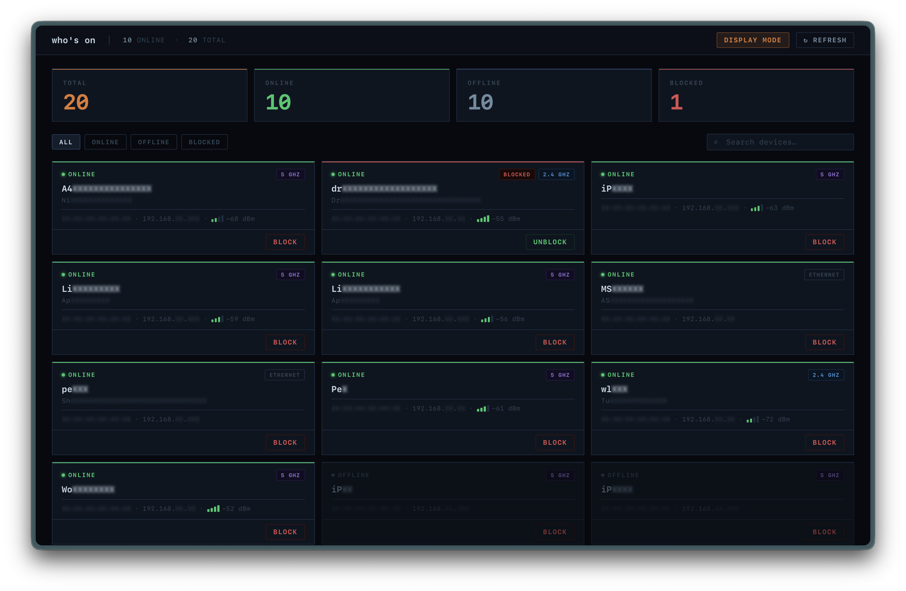

# who's on

Home network dashboard for the ASUS RT-AX1800S. Shows all connected devices and lets you block or unblock internet access per device. Comes as a web dashboard (`whoson-server`) and a CLI (`whoson-cli`).



I built this because I was paranoid about some IoT devices on my network having persistent network egress.
One day I'll figure out real (non-cloud) networking and implement some VPC-like stuff to manage this.

## Requirements

- Go 1.25+
- ASUS RT-AX1800S (or compatible ASUS router running the same firmware API)

## Build

```sh
just
```

Binaries are written to `bin/`. You can also build individually:

```sh
just whoson-cli
just whoson-server
```

Or with `go build` directly:

```sh
go build -o bin/whoson-cli ./cmd/whoson-cli
go build -o bin/whoson-server ./cmd/whoson-server
```

## Configuration

Create a `.env` file or export the following environment variables:

```
R_USER=admin
R_PASSWORD=yourpassword
OUI_DB=./testdata/ouiDB.json   # optional, improves vendor lookup
```

The server also respects `ROUTER_URL` (default `http://192.168.50.1`), `LISTEN_ADDR` (default `:8080`), and `OUI_DB`.

## Container

Pre-built images are published to GHCR on every push to `main` and on version tags:

```sh
docker run -p 8080:8080 \
  -e R_USER=admin \
  -e R_PASSWORD=yourpassword \
  ghcr.io/adityarathod/whoson/whoson-server:main
```

Use a version tag to pin to a release:

```sh
ghcr.io/adityarathod/whoson/whoson-server:1.2.3
```

To cut a new release, push a `v`-prefixed tag:

```sh
git tag v1.2.3
git push origin v1.2.3
```

This triggers the publish workflow and produces `1.2.3` and `1.2` image tags automatically.

To build and run locally instead:

```sh
just image
just image-run
```

## whoson-server

A web dashboard at `http://localhost:8080`. Shows all devices as cards with live status, connectivity, and signal strength. Supports filtering, search, and a display mode that redacts identifying information for screen sharing.

```sh
./bin/whoson-server
```

## whoson-cli

Lists devices and supports block/unblock from the command line.

```sh
# List all devices as JSON (default)
./bin/whoson-cli

# List as an ASCII table
./bin/whoson-cli --output-format table

# Block / unblock a device
./bin/whoson-cli --block AA:BB:CC:DD:EE:FF
./bin/whoson-cli --unblock AA:BB:CC:DD:EE:FF
```

### Output fields

| Field          | Description                                          |
| -------------- | ---------------------------------------------------- |
| `mac`          | Device MAC address                                   |
| `name`         | Device name (NickName preferred over Name)           |
| `ip`           | Current DHCP-assigned IP                             |
| `vendor`       | Hardware vendor (OUI DB, falls back to router value) |
| `rssi`         | Signal strength in dBm; empty for wired              |
| `online`       | Whether the device is currently connected            |
| `blocked`      | Whether internet access is blocked                   |
| `connectivity` | `wlan-24`, `wlan-5`, or `wired`                      |

## How it works

### Authentication

Login is a form POST to `/login.cgi`. Credentials are encoded as `base64(username:password)` in the `login_authorization` field — the same scheme as HTTP Basic Auth but sent as a form, not a header. On success the router sets an `asus_token` session cookie. All subsequent requests carry this cookie and require a `Referer: http://192.168.50.1/index.asp` header.

The router uses JavaScript redirects instead of HTTP 3xx — unauthenticated requests to any page return HTTP 200 with an inline JS redirect to `/Main_Login.asp`. Only one session is active at a time; logging in from a new IP requires the previous session to be terminated first.

### Device discovery

Device data is fetched from `/update_clients.asp`, which returns a JS file containing a `fromNetworkmapd` variable — a JSON array of `{MAC: ClientObject}` maps. Each object includes name, IP, RSSI, connectivity type (`isWL`: `0` = wired, `1` = 2.4 GHz, `2` = 5 GHz), and internet mode (`"allow"` or `"block"`).

### Block / unblock

Internet access is controlled through the router's Parental Controls (MULTIFILTER) system. The current ruleset is scraped from `/ParentalControl.asp`, which embeds the MULTIFILTER nvram state as JavaScript (`MULTIFILTER_MAC`, `MULTIFILTER_ENABLE`, `MULTIFILTER_DEVICENAME`). To block, a device's enable flag is set to `2`; to unblock, it's set to `0`. The updated state is POSTed to `/start_apply.htm` with `action_script=restart_firewall`.

## OUI database

Vendor names are resolved using the ASUS OUI database — a JSON map of 6-character hex OUI prefix to vendor name:

```
https://nw-dlcdnet.asus.com/plugin/js/ouiDB.json
```

Download it and point `OUI_DB` at the file. If unset, the router's own vendor string is used as a fallback.
